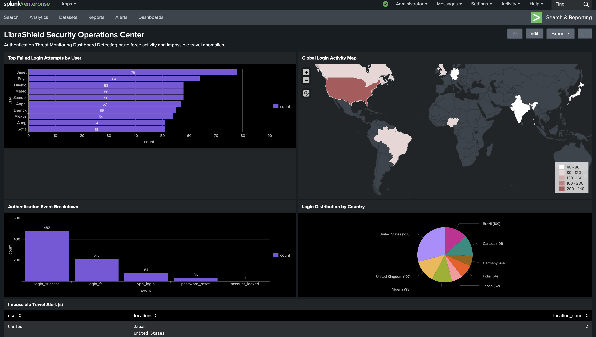
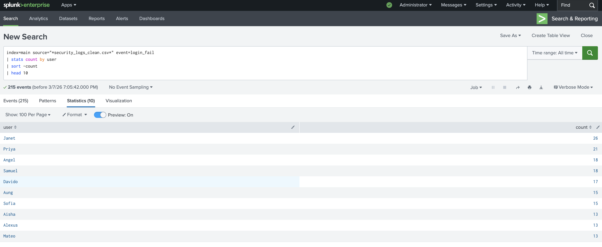
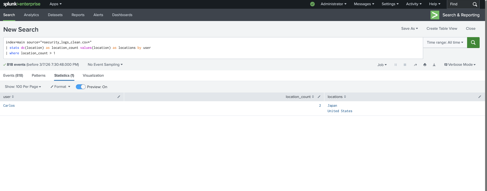

<p align="center">
  
</p>

# LibraShield SOC Monitoring


Splunk-based Security Operations Center (SOC) monitoring project detecting **brute force login attempts** and **impossible travel anomalies** from simulated authentication logs.

---

# Overview

LibraShield SOC Monitoring simulates a **Security Operations Center authentication monitoring environment** using Splunk.

The project demonstrates how security analysts detect suspicious login behavior using **log analysis, dashboards, and detection queries**.

This repository showcases detection engineering and investigation workflows commonly used by SOC analysts.

---

# Security Use Cases

## Brute Force Login Detection

Detects excessive failed authentication attempts from the same user account.

Example detection logic includes:

- Multiple login failures  
- Abnormal authentication spikes  
- Repeated attempts against the same user  

---

## Impossible Travel Detection

Detects users authenticating from multiple geographic locations within unrealistic timeframes.

Example scenario:

User: Carlos  
Location 1: United States  
Location 2: Japan  

This activity triggers an **Impossible Travel Alert**.

---

## Authentication Event Monitoring

Authentication activity monitored in the SOC dashboard includes:

- login_success  
- login_fail  
- password_reset  
- account_locked  
- vpn_login  

These events allow analysts to monitor authentication patterns and detect anomalies.

---

# SOC Monitoring Dashboard

<p align="center">
  
</p>

The dashboard provides a centralized view of authentication activity including:

- Global login activity map  
- Authentication event breakdown  
- Login distribution by country  
- Top failed login attempts  
- Impossible travel alerts  

---

# Detection Examples

## Brute Force Detection

<p align="center">
  
</p>

---

## Impossible Travel Detection

<p align="center">
  
</p>

---

## Investigation Example

Example investigation showing user **Carlos** triggering an impossible travel alert.

<p align="center">
  
</p>

---

## Detection Queries (SPL)

### Brute Force Login Detection

Detects excessive failed login attempts by user.

```spl
index=main source="*security_logs_clean.csv*" event=login_fail
| stats count by user
| sort -count
| head 10
```

---

### Impossible Travel Detection

Detects users authenticating from multiple geographic locations.

```spl
index=main source="*security_logs_clean.csv*"
| stats dc(location) as location_count values(location) as locations by user
| where location_count > 1
```

---

### Authentication Event Breakdown

Shows distribution of authentication activity.

```spl
index=main source="*security_logs_clean.csv*"
| stats count by event
| sort -count
```

---

### Login Activity by Country

Displays geographic login distribution.

```spl
index=main source="*security_logs_clean.csv*"
| stats count by location
| sort -count
```

---

## SOC Investigation Workflow

This project simulates how a Security Operations Center (SOC) analyst investigates suspicious authentication activity.

### Detection Process

1. Authentication logs are ingested into Splunk.
2. Detection queries analyze login behavior for anomalies.
3. Suspicious patterns trigger investigation.
4. Analysts validate anomalies using dashboards and search queries.

### Investigation Example

In this simulation, the user **Carlos** triggered an *Impossible Travel* alert by authenticating from:

- United States  
- Japan  

within an unrealistic timeframe.

In a real SOC environment, this behavior would typically trigger actions such as:

- Multi-Factor Authentication (MFA) challenge
- Temporary account lock
- SOC investigation ticket

---

## Dataset Generation

Authentication logs were generated using a Python script to simulate realistic SOC telemetry.

The dataset includes:

- Multiple users
- Global login locations
- Authentication events
- Brute force attempts
- VPN logins
- Password resets

### Example Dataset Fields

- `timestamp`
- `user`
- `event`
- `location`

This dataset was ingested into Splunk for analysis and visualization.

---

## Tools Used

### Security Tools

- Splunk Enterprise (SIEM)
- SPL (Search Processing Language)

### Development Tools

- Python
- GitHub
- macOS Terminal

---

## MITRE ATT&CK Mapping

The detections in this project align with techniques from the MITRE ATT&CK framework.

| Detection | MITRE Technique |
|----------|----------------|
| Brute Force Login | T1110 – Brute Force |
| Impossible Travel | T1078 – Valid Accounts |
| Authentication Monitoring | T1078 – Valid Accounts |

Reference: MITRE ATT&CK Enterprise Matrix

---

## Skills Demonstrated

This project demonstrates practical SOC analyst capabilities including:

- Security log analysis
- Threat detection engineering
- Splunk dashboard development
- Authentication monitoring
- Incident investigation
- SIEM query development
- Security telemetry analysis

---

## License

This project is licensed under the MIT License.
